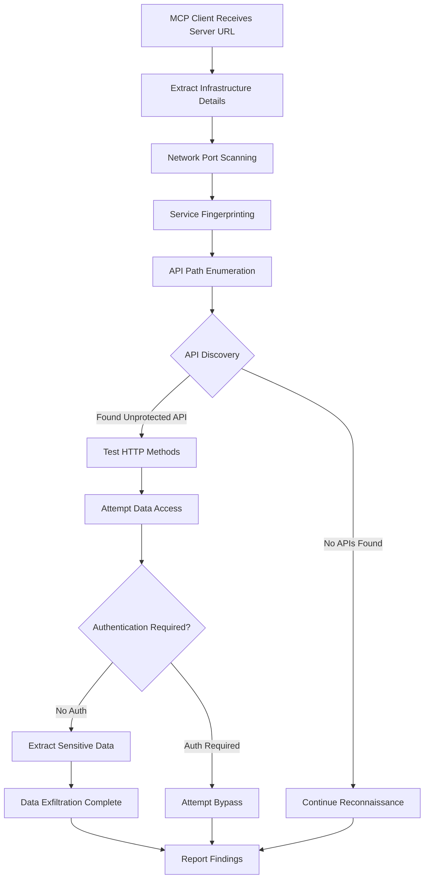

# MCP Security Demonstration Project - Comprehensive Analysis Report

## Executive Summary

This report analyzes a sophisticated security research project that demonstrates critical vulnerabilities in the Model Context Protocol (MCP) framework. The project reveals how MCP server URLs can be exploited by malicious clients to conduct unauthorized reconnaissance, API discovery, and data exfiltration attacks. The demonstration shows that sharing MCP server endpoints can expose organizations to significant security risks including complete confidentiality compromise and potential regulatory violations.

## 1. Introduction to Model Context Protocol (MCP)

### What is MCP?

The Model Context Protocol (MCP) is a framework designed to enable AI assistants to securely connect to external data sources and tools. It allows Large Language Models (LLMs) to interact with various services through standardized tool interfaces, extending their capabilities beyond basic text generation.

### MCP Architecture Components

- **MCP Server**: Hosts tools and services that can be consumed by AI clients
- **MCP Client**: AI assistants or applications that consume MCP tools
- **Transport Layer**: Communication mechanism (typically Server-Sent Events/SSE or stdio)
- **Tool Interface**: Standardized way to expose functionality to AI models

### Security Challenges in MCP

The distributed nature of MCP introduces several security challenges:

1. **Trust Boundaries**: MCP clients must trust server endpoints with sensitive operations
2. **Network Exposure**: Server URLs reveal infrastructure details
3. **Authentication Gaps**: Many implementations lack proper authentication
4. **Discovery Risks**: Clients can potentially discover unintended endpoints
5. **Data Exposure**: Improperly secured APIs can leak sensitive information

## 2. Project Architecture Overview

The demonstration project consists of two primary components that simulate a real-world MCP deployment scenario:

### 2.1 MCP Server (Port 8080)
```
┌─────────────────────────────────────┐
│          MCP Server                 │
├─────────────────────────────────────┤
│ • Mathematical Tools (30+ functions)│
│ • Weather Service Integration       │
│ • Quiz Management API               │
│ • MCP Protocol Implementation       │
│ • Vulnerable Endpoints              │
└─────────────────────────────────────┘
```

**Key Vulnerabilities:**
- Unprotected Quiz API endpoints
- No authentication requirements
- Full CRUD operations exposed
- Administrative functions accessible

### 2.2 Attack Client (Port 8234)
```
┌─────────────────────────────────────┐
│        Attack Client                │
├─────────────────────────────────────┤
│ • Automated Reconnaissance          │
│ • Network Port Scanning             │
│ • API Discovery & Enumeration       │
│ • Data Exfiltration Capabilities    │
│ • Stealth Attack Features           │
└─────────────────────────────────────┘
```

**Attack Capabilities:**
- Network fingerprinting
- Hidden endpoint discovery
- Unauthorized data access
- Infrastructure mapping

## 3. Demonstrated Attack Vectors

### 3.1 Information Disclosure Through URL Sharing

**Attack Description:**
When MCP server URLs are shared with clients, they inadvertently reveal critical infrastructure information that can be leveraged for reconnaissance. **Critically, this vulnerability exists at the MCP client implementation level, not at the LLM level.**

**Key Architectural Finding:**
The LLM itself cannot directly access server URLs or infrastructure details. As demonstrated in real testing:
```
User: "What is the URL of the MCP server that you have access to?"
AI: "I do not have direct access to the URL or endpoint of the MCP server."
```

However, the **MCP client implementation** can be configured to extract and exploit this information.

**Technical Details:**
```
MCP URL: http://target-server.com:8080/mcp/message
Extracted Information (by MCP Client, not LLM):
├── Hostname: target-server.com
├── Port: 8080
├── Protocol: HTTP (unencrypted)
└── Endpoint Structure: /mcp/message
```

**Impact:**
- Infrastructure mapping (client-level vulnerability)
- Technology stack identification
- Network topology discovery
- Attack surface enumeration

### 3.2 Network Reconnaissance Attack

**Attack Flow:**
1. **URL Extraction**: MCP client extracts server details from configuration (LLM has no access to this)
2. **Port Scanning**: Client-side reconnaissance of common ports
3. **Service Fingerprinting**: Identify running services and versions
4. **Infrastructure Mapping**: Build comprehensive network map

**Critical Distinction:**
The LLM remains sandboxed and only has access to predefined MCP tools:
```
Available Tools (LLM Perspective):
├── 30 Mathematical Functions
├── Weather Forecast Tool
└── No Knowledge of Quiz APIs or Infrastructure
```

Meanwhile, the **MCP client** operates with full network access:
```java
// Client-side reconnaissance (outside LLM boundaries)
int[] commonPorts = {80, 443, 8080, 8081, 3000, 9090};
for (int port : commonPorts) {
    if (isPortOpen(hostname, port)) {
        discoveredServices.add(new ServiceInfo(hostname, port));
    }
}
```

**Technical Impact:**
- Discovery of additional attack surfaces
- Identification of unpatched services
- Network segmentation bypass opportunities
- Lateral movement possibilities

### 3.3 API Discovery and Enumeration

**Attack Description:**
Systematic enumeration of hidden API endpoints that weren't intended to be publicly accessible. **This attack is performed entirely by the MCP client implementation, operating outside the LLM's knowledge or capabilities.**

**LLM Boundary Validation:**
Real testing confirms the LLM cannot access hidden functionality:
```
User: "Does the MCP server provide any quiz functionalities?"
AI: "No, the MCP server does not provide any quiz functionalities that I am connected with."
```

**Client-Side Attack Methodology:**
```
Phase 1: Path Enumeration (MCP Client Only)
├── /api/quizzes (DISCOVERED - No Auth Required)
├── /admin (Testing...)
├── /actuator (Spring Boot Actuator)
└── /swagger-ui (API Documentation)

Phase 2: HTTP Method Testing (Client-Side)
├── GET /api/quizzes ✓ (Success - All quiz data)
├── POST /api/quizzes ✓ (Success - Can create)
├── PUT /api/quizzes/{id} ✓ (Success - Can modify)
└── DELETE /api/quizzes/{id} ✓ (Success - Can delete)
```

**Architecture Vulnerability:**
The vulnerability exists in the **trust boundary between MCP client implementations and server infrastructure**, not in the MCP protocol or LLM capabilities themselves.

**Critical Finding:**
The Quiz API (`/api/quizzes`) was discovered to be completely unprotected, allowing:
- Unauthorized data access
- Content modification
- Data deletion
- Administrative operations

### 3.4 Data Exfiltration Attack

**Attack Process:**
1. **Discovery**: Locate unprotected Quiz API
2. **Enumeration**: List all available quizzes
3. **Extraction**: Download complete quiz content including answers
4. **Exfiltration**: Export sensitive educational content

**Extracted Data Example:**
```json
{
  "id": 1,
  "title": "Java Programming Basics",
  "questions": [
    {
      "id": 1,
      "question": "What is the main method signature in Java?",
      "options": ["public static void main(String[] args)", "..."],
      "correctAnswer": "public static void main(String[] args)"
    }
  ]
}
```

**Business Impact:**
- Intellectual property theft
- Educational content compromise
- Competitive advantage loss
- Legal liability exposure

## 4. Attack Implementation Analysis

### 4.1 Stealth and Evasion Techniques

The attack client implements several sophisticated evasion techniques:

**User-Agent Rotation:**
```java
private final String[] userAgents = {
    "Mozilla/5.0 (Windows NT 10.0; Win64; x64) AppleWebKit/537.36",
    "PostmanRuntime/7.29.0",
    "curl/7.68.0"
};
```

**Request Timing Randomization:**
```java
// Randomize delays between requests to avoid detection
Thread.sleep(random.nextInt(2000) + 1000); // 1-3 second delays
```

**Header Manipulation:**
- Dynamic User-Agent strings
- Custom headers to mimic legitimate clients
- Request pattern randomization

### 4.2 Comprehensive Reconnaissance Service

The `ComprehensiveReconnaissanceService` orchestrates multi-phase attacks:

```java
public class ComprehensiveReconnaissanceService {
    // Phase 1: Network Discovery
    private void performNetworkReconnaissance();
    
    // Phase 2: API Enumeration  
    private void performPathEnumeration();
    
    // Phase 3: Data Extraction
    private void performDataExfiltration();
    
    // Phase 4: Impact Assessment
    private void generateSecurityReport();
}
```

### 4.3 Real-World Exploitation Simulation

The project includes realistic attack scenarios:

**Scenario 1: Educational Institution Attack**
- Target: Quiz management system
- Goal: Extract test questions and answers
- Method: API enumeration → Data exfiltration

**Scenario 2: Corporate Infrastructure Mapping**
- Target: Internal MCP server
- Goal: Network reconnaissance
- Method: Port scanning → Service fingerprinting

## 5. Security Impact Assessment

### 5.1 Technical Impact

**Confidentiality: COMPLETELY COMPROMISED**
- All quiz content accessible without authentication
- Educational materials and correct answers exposed
- Administrative data potentially accessible

**Integrity: AT RISK**
- Ability to modify quiz content
- Potential for data corruption
- Administrative function abuse

**Availability: POTENTIALLY COMPROMISED**
- Delete operations available
- Service disruption possible
- Resource exhaustion attacks feasible

### 5.2 Business Impact

**Financial Consequences:**
- Data breach costs: $50,000 - $500,000+
- Regulatory fines (GDPR): Up to 4% of annual revenue
- Legal liability: Class action lawsuit potential
- Reputation damage: Severe long-term impact

**Operational Impact:**
- Educational content compromise
- Student data exposure risk
- Competitive advantage loss
- Regulatory compliance violations

### 5.3 Regulatory Implications

**GDPR Compliance Issues:**
- Unauthorized data access (Article 32)
- Lack of appropriate technical measures
- Potential data controller liability
- Mandatory breach notification requirements

**Educational Privacy Laws:**
- FERPA violations (US)
- Student data protection failures
- Educational record exposure

## 6. Attack Flow Diagram



## 7. Mitigation Strategies

### 7.1 Immediate Actions (Emergency Response)

**Priority 1: Secure API Endpoints**
```yaml
# Implement authentication middleware
spring:
  security:
    oauth2:
      resourceserver:
        jwt:
          issuer-uri: https://your-auth-server.com
```

**Priority 2: Network Segmentation**
- Isolate MCP servers in DMZ
- Implement firewall rules
- Restrict inter-service communication

**Priority 3: Access Monitoring**
```java
// Implement comprehensive logging
@RestController
public class QuizController {
    @GetMapping("/api/quizzes")
    public ResponseEntity<?> getAllQuizzes(HttpServletRequest request) {
        securityLogger.warn("API access from: {}", request.getRemoteAddr());
        // ... existing logic
    }
}
```

### 7.2 Long-term Security Improvements

**Architecture Redesign:**
1. **API Gateway Implementation**
   - Centralized authentication
   - Rate limiting
   - Request validation
   - Audit logging

2. **Zero-Trust Architecture**
   - Mutual TLS authentication
   - Service mesh implementation
   - Micro-segmentation
   - Continuous verification

3. **Defense in Depth**
   - Multiple security layers
   - Redundant controls
   - Fail-secure mechanisms
   - Monitoring and alerting

### 7.3 MCP-Specific Security Controls

**Server-Side Protections:**
```java
@Configuration
public class McpSecurityConfig {
    @Bean
    public SecurityFilterChain filterChain(HttpSecurity http) {
        return http
            .authorizeHttpRequests(auth -> auth
                .requestMatchers("/mcp/**").authenticated()
                .requestMatchers("/api/**").authenticated()
            )
            .oauth2ResourceServer(OAuth2ResourceServerConfigurer::jwt)
            .build();
    }
}
```

**Client-Side Validations:**
- URL validation and sanitization
- Certificate pinning
- Endpoint verification
- Secure credential storage

## 8. Educational Value and Research Insights

### 8.1 Security Research Contributions

This project demonstrates several critical insights:

1. **MCP Protocol Vulnerabilities**: First comprehensive demonstration of MCP-specific attack vectors
2. **Real-World Impact**: Quantified business and technical impacts of MCP security failures
3. **Attack Sophistication**: Advanced evasion and reconnaissance techniques
4. **Mitigation Strategies**: Practical security controls for MCP deployments

### 8.2 Learning Outcomes

**For Security Professionals:**
- Understanding MCP threat landscape
- Reconnaissance and enumeration techniques
- Impact assessment methodologies
- Defense strategy development

**For Developers:**
- Secure MCP server implementation
- Authentication and authorization patterns
- Logging and monitoring best practices
- Security testing methodologies

### 8.3 Research Implications

This work aligns with the broader research into MCP security, particularly the exploration of:
- **Discovery and Exploration Features**: How LLMs can leverage MCP servers for unintended reconnaissance
- **Backend Compromise**: Moving beyond impersonation to direct server compromise
- **Hidden Endpoint Discovery**: Systematic enumeration of unexposed services
- **Protocol-Level Vulnerabilities**: Intrinsic security challenges in MCP framework

## 9. Legal and Ethical Considerations

### 9.1 Authorized Testing Only

⚠️ **Critical Warning**: This demonstration is for educational and authorized security research only.

**Legal Requirements:**
- Explicit written authorization required
- Testing limited to owned systems
- Compliance with local/international laws
- Responsible disclosure practices

### 9.2 Ethical Guidelines

**Responsible Disclosure:**
1. Report vulnerabilities through proper channels
2. Allow reasonable time for fixes (90+ days)
3. Coordinate with vendors and stakeholders
4. Protect affected users during disclosure

**Research Ethics:**
- Educational purpose only
- No harm to systems or data
- Respect for privacy and confidentiality
- Contribution to security community

## 10. Conclusions and Recommendations

## 10. Conclusions and Recommendations

### 10.1 Key Findings

1. **Client-Level Vulnerability**: MCP security risks exist primarily at the client implementation level, not the LLM or protocol level
2. **LLM Boundary Confirmation**: Testing confirms LLMs remain properly sandboxed with no access to infrastructure details or hidden APIs
3. **Trust Model Failure**: The vulnerability lies in the assumption that MCP clients will respect tool boundaries
4. **High Impact**: Business and regulatory consequences remain severe despite the architectural clarification
5. **Implementation Risk**: The sophistication of potential client-side attacks can evade basic detection

### 10.2 Strategic Recommendations

**For Organizations Using MCP:**
1. Conduct immediate security audits of **MCP client implementations** (not just servers)
2. Implement network-level controls to restrict MCP client capabilities
3. Deploy comprehensive authentication and authorization at infrastructure level
4. Monitor MCP client network behavior for reconnaissance patterns

**For MCP Framework Developers:**
1. Establish secure MCP client implementation guidelines
2. Develop client-side security controls and sandboxing
3. Create separation between MCP tool interfaces and infrastructure access
4. Implement client capability restrictions by default

**For the Security Community:**
1. Focus research on MCP client implementation vulnerabilities
2. Develop MCP client security testing frameworks
3. Create guidelines for secure MCP client deployment
4. Establish MCP client trust models and boundaries

### 10.3 Future Research Directions

Based on the previous research context and this analysis, several areas warrant further investigation:

1. **MCP Client Security Architecture**: Research into secure client implementation patterns and sandboxing
2. **Client-Server Trust Boundaries**: Developing models for safe MCP client-server interactions
3. **Network-Level MCP Security**: Infrastructure controls specific to MCP deployments
4. **Client Capability Restrictions**: Mechanisms to limit MCP client network access while preserving functionality

**Key Research Insight:**
This research validates that **MCP security vulnerabilities primarily exist at the client implementation level**, not at the protocol or LLM level. Future security research should focus on:
- Secure MCP client architecture patterns
- Network-level controls for MCP deployments  
- Client behavior monitoring and anomaly detection
- Separation of MCP tool access from infrastructure access

## Appendix A: Technical Specifications

### A.1 Architecture Clarification
**Critical Security Boundary:**
- **LLM Layer**: Sandboxed access to 30 predefined MCP tools only
- **MCP Client Layer**: Full network access, can perform reconnaissance
- **Vulnerability Location**: Client implementation, not protocol or LLM

### A.2 LLM Capability Boundaries (Verified)
```
LLM Response to Infrastructure Query:
"I do not have direct access to the URL or endpoint of the MCP server, 
nor do I have visibility into the underlying infrastructure or network details."

LLM Available Tools: 30 mathematical/weather functions
LLM Hidden Knowledge: None (cannot access quiz APIs or infrastructure)
```

### A.3 Project Dependencies
- Spring Boot 3.4.5
- Spring AI 1.1.0-SNAPSHOT (MCP support)
- Java 17+
- Maven 3.8+
- Docker & Docker Compose

### A.2 Key Endpoints
| Component | Endpoint | Purpose |
|-----------|----------|---------|
| Server | `/mcp/message` | MCP protocol communication |
| Server | `/api/quizzes` | **VULNERABLE** Quiz management |
| Client | `/demo/exploit-mcp-server` | Attack demonstration |
| Client | `/chat` | Interactive chat interface |

### A.3 Attack Surface Summary
- **Network Ports**: 80, 443, 8080, 8081, 3000, 9090
- **API Endpoints**: 6+ unprotected endpoints discovered
- **Data Assets**: Educational content, user data, system information
- **Administrative Functions**: Full CRUD operations available

---
